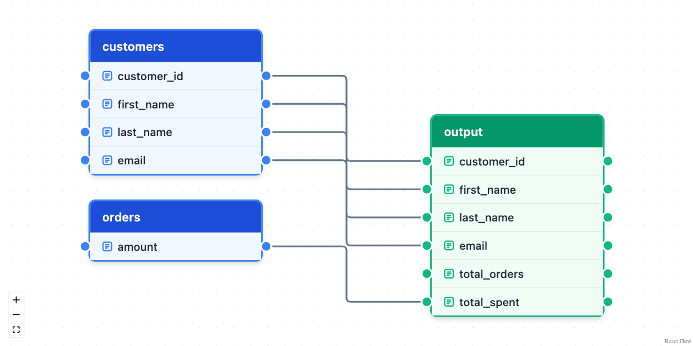
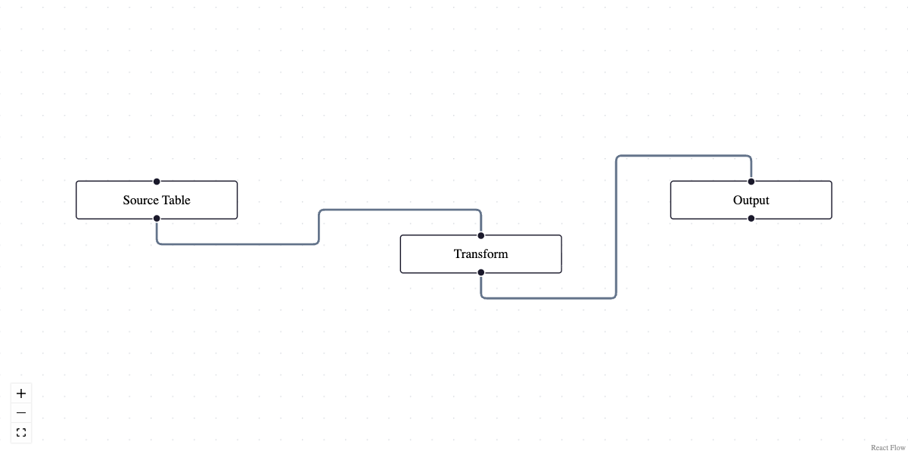

<!-- README.md is generated from README.Rmd. Please edit that file -->

# dplyneage

Column lineage visualization for dplyr and dbplyr pipelines.

## Installation

``` r
pak::pak("tgerke/dplyneage")
```

The package uses [sqlglot](https://github.com/tobymao/sqlglot) via
reticulate to automatically extract column lineage from SQL queries
generated by dplyr/dbplyr. Python dependencies are provisioned
automatically the first time lineage extraction runs (via
`reticulate::py_require()`) — no manual setup needed.

## Quick Start

### Automatic Lineage from dplyr/dbplyr (Recommended)

Extract column lineage automatically from your dplyr pipelines:

``` r
library(dplyneage)
library(dplyr)
library(dbplyr)
library(duckdb)

# Connect to database
con <- dbConnect(duckdb::duckdb(), ":memory:")

# Create sample data
customers <- tibble(
  customer_id = 1:5,
  first_name = c("Alice", "Bob", "Charlie", "Diana", "Eve"),
  last_name = c("Smith", "Jones", "Brown", "Wilson", "Davis"),
  email = paste0(tolower(first_name), "@example.com")
)

orders <- tibble(
  order_id = 1:10,
  customer_id = rep(1:5, each = 2),
  amount = c(100, 150, 200, 75, 300, 125, 180, 90, 250, 160)
)

# Copy to database
copy_to(con, customers, "customers", overwrite = TRUE)
copy_to(con, orders, "orders", overwrite = TRUE)

# Create a dplyr pipeline and visualize lineage
tbl(con, "customers") |>
  select(customer_id, first_name, last_name, email) |>
  left_join(tbl(con, "orders"), by = "customer_id") |>
  group_by(customer_id, first_name, last_name, email) |>
  summarise(
    total_orders = n(),
    total_spent = sum(amount, na.rm = TRUE),
    .groups = "drop"
  ) |>
  extract_lineage() |>
  lineage_flow(height = "600px")
```

<!-- -->

The `extract_lineage()` function: - Converts your dplyr pipeline to SQL
using `dbplyr::sql_render()` - Traces every output column to its source
columns with sqlglot’s lineage engine (aliases, CTEs, subqueries,
unions, and multi-source computed columns all resolve correctly) - Reads
table schemas from your database connection so unqualified columns are
attributed to the right table (pass `schema` manually for raw SQL) -
Automatically creates nodes and edges for visualization - Supports
multiple SQL dialects (DuckDB, PostgreSQL, MySQL, Snowflake, BigQuery,
etc.)

**Features:**

- 🎨 Color-coded tables (blue=source, orange=transform, green=target)
- 🔗 Column-to-column connections with transformation labels
- ⚡ Animated edges for aggregations
- 🖱️ Drag nodes, zoom/pan, create new connections
- 📊 Industry-standard styling (dbt/SQLMesh-inspired)

### Creating Custom Column Lineage

Build your own column-level lineage visualizations:

``` r
# Define tables with columns
customers <- create_table_node(
  table_name = "customers",
  columns = c("customer_id", "name", "email", "signup_date"),
  x = 0,
  y = 50,
  table_type = "source"
)

orders <- create_table_node(
  table_name = "orders", 
  columns = c("order_id", "customer_id", "order_date", "total_amount"),
  x = 0,
  y = 300,
  table_type = "source"
)

customer_summary <- create_table_node(
  table_name = "customer_summary",
  columns = c("customer_id", "customer_name", "email", "first_order", "total_spent"),
  x = 500,
  y = 150,
  table_type = "target"
)

# Connect specific columns with transformation labels
edges <- list(
  create_column_edge("customers", "customer_id", "customer_summary", "customer_id"),
  create_column_edge("customers", "name", "customer_summary", "customer_name"),
  create_column_edge("customers", "email", "customer_summary", "email"),
  create_column_edge("orders", "order_date", "customer_summary", "first_order", 
                     label = "MIN()", animated = TRUE),
  create_column_edge("orders", "total_amount", "customer_summary", "total_spent",
                     label = "SUM()", animated = TRUE)
)

# Render the lineage
lineage_flow(
  nodes = list(customers, orders, customer_summary),
  edges = edges,
  height = "600px"
)
#> file:////private/var/folders/fw/0d9nr9951q57f0d5l6qc1j200000gn/T/Rtmp2WVEHr/file6ed32569b818/widget6ed33fb542d8.html screenshot completed
```

<!-- -->

### Low-Level API (Node-Level Lineage)

For simpler visualizations showing table-to-table relationships:

``` r
lineage_flow(
  nodes = list(
    list(id = "1", position = list(x = 0, y = 50), data = list(label = "Source Table")),
    list(id = "2", position = list(x = 300, y = 100), data = list(label = "Transform")),
    list(id = "3", position = list(x = 550, y = 50), data = list(label = "Output"))
  ),
  edges = list(
    list(id = "e1-2", source = "1", target = "2"),
    list(id = "e2-3", source = "2", target = "3")
  )
)
#> file:////private/var/folders/fw/0d9nr9951q57f0d5l6qc1j200000gn/T/Rtmp2WVEHr/file6ed342cf5618/widget6ed33a1d63ec.html screenshot completed
```

<!-- -->

### Works with ducklake

Because `extract_lineage()` accepts any dbplyr lazy table, it composes
directly with packages that produce them — for example
[ducklake](https://github.com/tgerke/ducklake-r) tables:

``` r
library(ducklake)

get_ducklake_table("orders") |>
  dplyr::left_join(get_ducklake_table("customers"), by = "customer_id") |>
  dplyr::group_by(customer_id) |>
  dplyr::summarise(total = sum(amount, na.rm = TRUE)) |>
  extract_lineage() |>
  lineage_flow()
```

## Interactive Features

With the React Flow bundle built, you can:

- **Drag nodes** - Click and drag to reposition tables
- **Zoom/Pan** - Mouse wheel to zoom, drag background to pan
- **Connect columns** - Drag from any column handle to another to create
  connections
- **Select elements** - Click nodes or edges to select them
- **Snap to grid** - Nodes snap to a 15px grid for clean alignment

## Table Types & Color Scheme

Following industry standards from dbt/SQLMesh/OpenMetadata:

| Type        | Color            | Use Case                         |
|-------------|------------------|----------------------------------|
| `source`    | Blue (#3b82f6)   | Raw/source tables                |
| `transform` | Orange (#f59e0b) | Intermediate transformations     |
| `target`    | Green (#10b981)  | Final output/materialized tables |

## Current Status

- ✅ React Flow integration with interactive canvas
- ✅ Column-level lineage visualization
- ✅ Custom table nodes with handle-based connections
- ✅ Professional styling (dbt/SQLMesh-inspired)
- ✅ Drag, zoom, pan, and connect interactively
- ✅ Automatic lineage extraction from dplyr/dbplyr pipelines via
  sqlglot’s lineage engine
- ✅ CTEs, subqueries, unions, aliases, and multi-source computed
  columns
- ✅ Schema-aware column attribution (automatic for dbplyr, `schema` arg
  for raw SQL)
- ✅ dbplyr support with DuckDB backend (and other SQL dialects)
- 🚧 Pure-R lineage fast path for dplyr-only pipelines (no Python), via
  dbplyr’s lazy query tree
- 🚧 Export lineage to common formats (JSON, GraphML)

## Package Structure

- `R/lineage_flow.R` - Main R function for creating visualizations
- `R/column_lineage.R` - Helper functions for column-level lineage
  diagrams
- `R/sqlglot_utils.R` - Lineage extraction orchestration (SQL rendering,
  schema harvesting, graph building)
- `inst/python/dplyneage_lineage.py` - Python lineage engine built on
  `sqlglot.lineage`
- `inst/htmlwidgets/lineage_flow.js` - JavaScript widget with React Flow
  integration
- `inst/htmlwidgets/lineage_flow.yaml` - Widget dependencies
  configuration
- `srcjs/` - React Flow bundle source code (rebuild with
  `./build_bundle.sh`)

## API Reference

**Automatic Lineage Extraction:**

- `extract_lineage(sql, dialect, schema)` - Extract column lineage from
  SQL query or dbplyr lazy table
- `has_sqlglot()` - Check if the Python sqlglot dependency is available
  (provisioned automatically)

**Bundle Management:**

- `has_bundle()` - Check if the pre-built React Flow bundle exists

**Manual Lineage Creation:**

### Core Functions

- `lineage_flow(nodes, edges, width, height)` - Main visualization
  function
- `create_table_node(table_name, columns, x, y, table_type)` - Create a
  table node with columns
- `create_column_edge(from_table, from_column, to_table, to_column, label, animated)` -
  Connect columns with optional transformation labels
- `lineage_example()` - Built-in example showing column-level lineage

### Node Structure (Low-Level)

``` r
node <- list(
  id = "unique_id",
  type = "tableNode",  # or "default"
  position = list(x = 100, y = 100),
  data = list(
    label = "Table Name",
    columns = c("col1", "col2", "col3"),  # for tableNode type
    tableType = "source"  # "source", "transform", or "target"
  )
)
```

### Edge Structure (Low-Level)

``` r
edge <- list(
  id = "unique_edge_id",
  source = "source_node_id",
  target = "target_node_id",
  sourceHandle = "source_table.column_name",  # for column-level lineage
  targetHandle = "target_table.column_name",
  label = "TRANSFORM",  # optional
  animated = TRUE  # optional, for emphasis
)
```

## How It Works

The package uses a multi-layered approach to lineage tracking:

1.  **dplyr/dbplyr Pipeline** → Your familiar tidyverse code
2.  **SQL Generation** → `dbplyr::sql_render()` converts dplyr to SQL
3.  **Lineage Extraction** → `sqlglot` (Python) parses SQL and extracts
    column-level lineage
4.  **Graph Creation** → R creates nodes and edges from lineage data
5.  **Visualization** → React Flow renders interactive lineage diagram

### Supported SQL Dialects

Thanks to sqlglot, the package supports many SQL dialects:

- DuckDB (default)
- PostgreSQL
- MySQL
- Snowflake
- BigQuery
- Redshift
- SQLite
- Oracle
- And many more…

Specify the dialect when extracting lineage. NOTE: this remains untested
across many/most dialects!

``` r
extract_lineage(query, dialect = "postgres")
```
