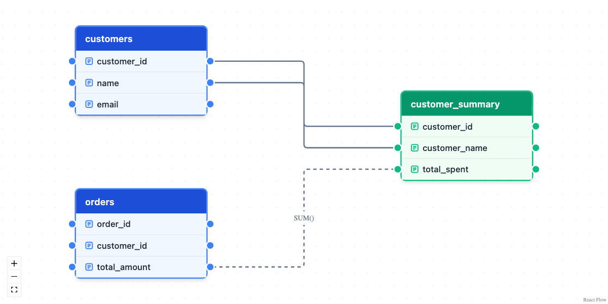

# dplyneage

dplyneage draws interactive column-level lineage diagrams for dplyr and
dbplyr pipelines. Pipe a query into
[`extract_lineage()`](https://tgerke.github.io/dplyneage/reference/extract_lineage.md)
and it traces every output column back to the source columns it came
from — through joins, aggregations, CTEs, unions, and computed
expressions — then renders the result as a draggable, zoomable [React
Flow](https://reactflow.dev/) diagram with
[`lineage_flow()`](https://tgerke.github.io/dplyneage/reference/lineage_flow.md).

Under the hood, lineage is computed by
[sqlglot](https://github.com/tobymao/sqlglot)’s dedicated lineage
engine, so raw SQL in many dialects (DuckDB, PostgreSQL, Snowflake,
BigQuery, …) works too.

## Installation

``` r

pak::pak("tgerke/dplyneage")
```

The Python dependency (sqlglot) is provisioned automatically the first
time lineage extraction runs, via
[`reticulate::py_require()`](https://rstudio.github.io/reticulate/reference/py_require.html)
— there is no setup step. See
[`vignette("python-integration")`](https://tgerke.github.io/dplyneage/articles/python-integration.md)
if you manage your own Python environment.

## Usage

Build a dplyr pipeline against a database as usual, then pipe it into
[`extract_lineage()`](https://tgerke.github.io/dplyneage/reference/extract_lineage.md)
and
[`lineage_flow()`](https://tgerke.github.io/dplyneage/reference/lineage_flow.md):

``` r

library(dplyneage)
library(dplyr)
library(dbplyr)
library(duckdb)

con <- dbConnect(duckdb::duckdb(), ":memory:")

customers <- tibble(
  customer_id = 1:5,
  first_name = c("Alice", "Bob", "Charlie", "Diana", "Eve"),
  last_name = c("Smith", "Jones", "Brown", "Wilson", "Davis"),
  email = paste0(tolower(first_name), "@example.com")
)

orders <- tibble(
  order_id = 1:10,
  customer_id = rep(1:5, each = 2),
  amount = c(100, 150, 200, 75, 300, 125, 180, 90, 250, 160)
)

copy_to(con, customers, "customers", overwrite = TRUE)
copy_to(con, orders, "orders", overwrite = TRUE)

tbl(con, "customers") |>
  select(customer_id, first_name, last_name, email) |>
  left_join(tbl(con, "orders"), by = "customer_id") |>
  group_by(customer_id, first_name, last_name, email) |>
  summarise(
    total_orders = n(),
    total_spent = sum(amount, na.rm = TRUE),
    .groups = "drop"
  ) |>
  extract_lineage() |>
  lineage_flow(height = "600px")
```


Behind that one pipe,
[`extract_lineage()`](https://tgerke.github.io/dplyneage/reference/extract_lineage.md):

- converts your pipeline to SQL with
  [`dbplyr::sql_render()`](https://dbplyr.tidyverse.org/reference/sql_build.html)
- traces every output column to its source columns with sqlglot’s
  lineage engine (aliases, CTEs, subqueries, unions, and multi-source
  computed columns all resolve correctly)
- reads table schemas from your database connection so unqualified
  columns are attributed to the right table (pass `schema` manually for
  raw SQL)

The resulting diagram is fully interactive: drag tables to rearrange,
zoom and pan, and hover columns to highlight their connections.

## Building diagrams by hand

For documentation or design work, you can construct lineage diagrams
directly with
[`create_table_node()`](https://tgerke.github.io/dplyneage/reference/create_table_node.md)
and
[`create_column_edge()`](https://tgerke.github.io/dplyneage/reference/create_column_edge.md):

``` r

nodes <- list(
  create_table_node(
    table_name = "customers",
    columns = c("customer_id", "name", "email"),
    x = 0, y = 50,
    table_type = "source"
  ),
  create_table_node(
    table_name = "orders",
    columns = c("order_id", "customer_id", "total_amount"),
    x = 0, y = 300,
    table_type = "source"
  ),
  create_table_node(
    table_name = "customer_summary",
    columns = c("customer_id", "customer_name", "total_spent"),
    x = 500, y = 150,
    table_type = "target"
  )
)

edges <- list(
  create_column_edge("customers", "customer_id", "customer_summary", "customer_id"),
  create_column_edge("customers", "name", "customer_summary", "customer_name"),
  create_column_edge("orders", "total_amount", "customer_summary", "total_spent",
                     label = "SUM()", animated = TRUE)
)

lineage_flow(nodes, edges, height = "600px")
#> file:////private/var/folders/fw/0d9nr9951q57f0d5l6qc1j200000gn/T/RtmpLmDEK6/filebd3e26dfe48b/widgetbd3e3515759d.html screenshot completed
```



Table types follow the color conventions used by dbt and SQLMesh:

| Type        | Color  | Use case                         |
|-------------|--------|----------------------------------|
| `source`    | Blue   | Raw/source tables                |
| `transform` | Orange | Intermediate transformations     |
| `target`    | Green  | Final output/materialized tables |

## Works with ducklake

Because
[`extract_lineage()`](https://tgerke.github.io/dplyneage/reference/extract_lineage.md)
accepts any dbplyr lazy table, it composes directly with packages that
produce them — for example
[ducklake](https://github.com/tgerke/ducklake-r) tables:

``` r

library(ducklake)

get_ducklake_table("orders") |>
  dplyr::left_join(get_ducklake_table("customers"), by = "customer_id") |>
  dplyr::group_by(customer_id) |>
  dplyr::summarise(total = sum(amount, na.rm = TRUE)) |>
  extract_lineage() |>
  lineage_flow()
```

## Learn more

- [`vignette("getting-started")`](https://tgerke.github.io/dplyneage/articles/getting-started.md)
  walks from a first diagram through CTEs, multi-source columns, and
  schemas
- [`vignette("python-integration")`](https://tgerke.github.io/dplyneage/articles/python-integration.md)
  covers how the Python dependency is managed
- Full function reference at
  [tgerke.github.io/dplyneage](https://tgerke.github.io/dplyneage/)

## Roadmap

- 🚧 Pure-R lineage fast path for dplyr-only pipelines (no Python), via
  dbplyr’s lazy query tree
- 🚧 Export lineage to common formats (JSON, GraphML)
